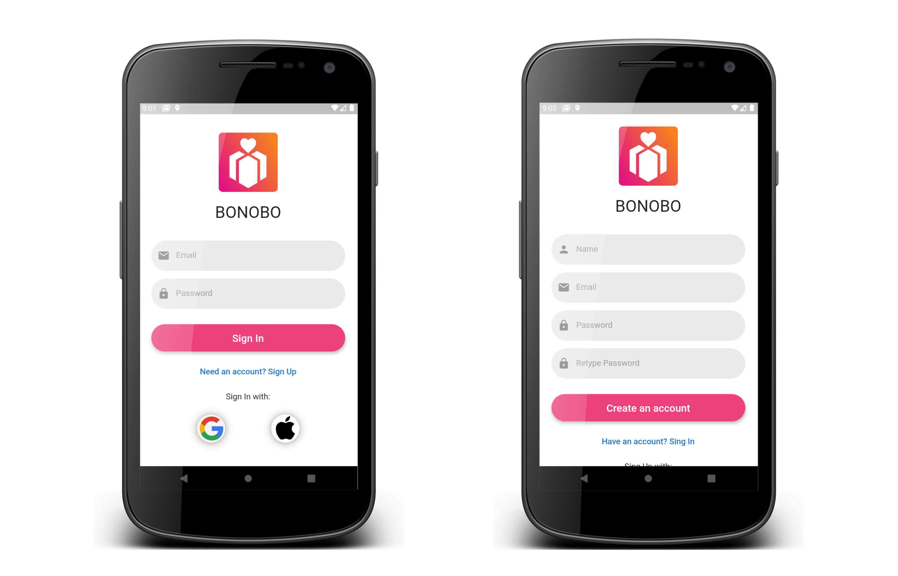
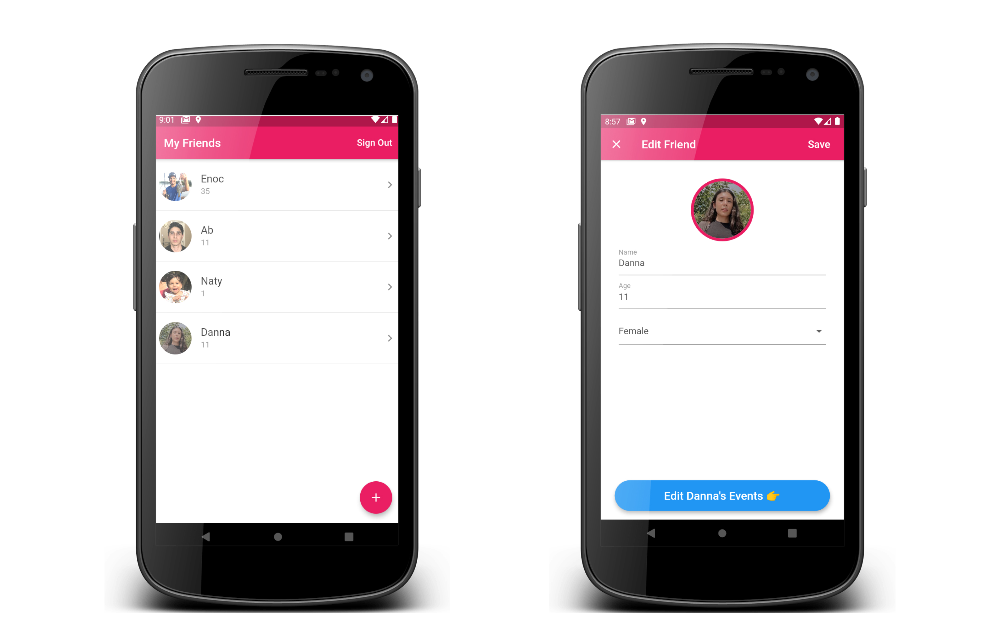
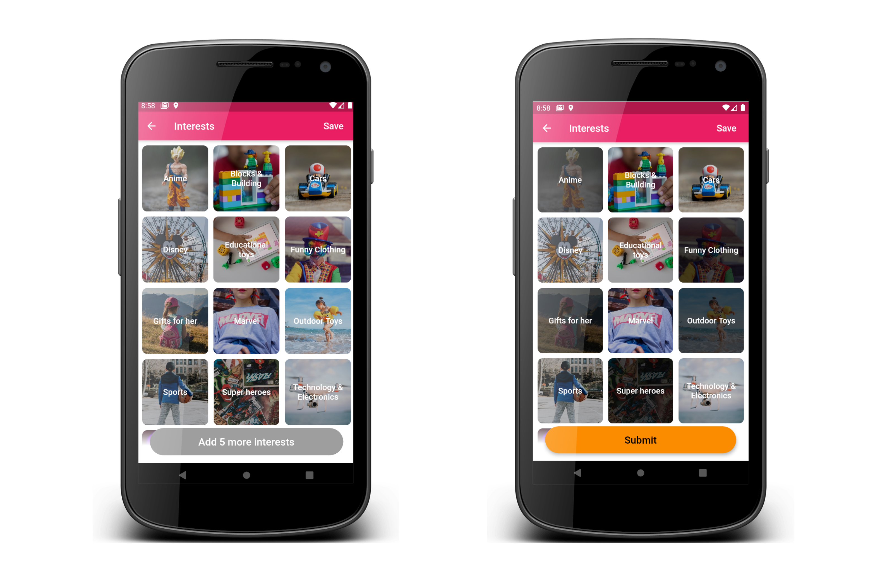
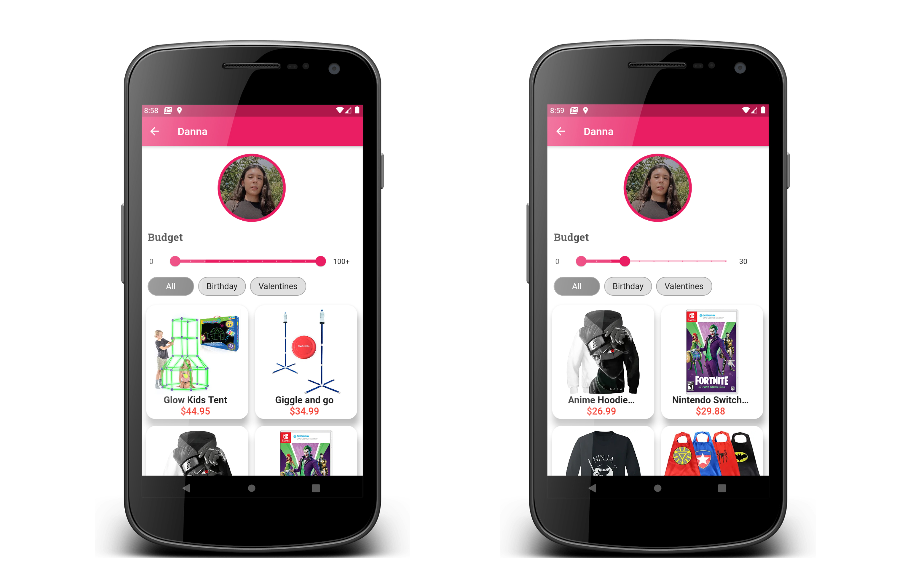

# Bonobo

Bonobo is an event reminder plus gift recommendations app. Bonobo helps you remember important friend's or family's events while giving you mindful gift recommendations depending on their interests.

# Motivation

Bonobo was created to help solve the problem of forgetting important dates plus not having idea of what to give them at the last moment. Bonobo solves this problem by reminding you of your friend's important events in advance plus listing the best Amazon products.

# Features:

- Login
- Add, Edit, Delete Friend's Info and Profile Picture
- Add, Edit, Delete Friend's Events
- Add, Edit Friend's Interests
- Generate Friend Profile with:
  - Gift Recommendations gotten by querying friend's Age, Gender, Interests, Event, and Budget

# Screenshots






# Upcoming Features:

- Home Page
- User Profile with:
  - Product Recommendations gotten by querying user's Age, Gender, Interests, and Budget
- Favorite Products
- Calendar

# Tech/Framework Used

- Flutter
- Provider
- Firebase
  - Authentication
  - Firestore (Realtime Database)
  - Cloud Storage

# Troubleshoot

If you're getting an error like this:

`Podfile is out of date please try 'pod repo update'`

This could be caused because the following line in podfile:

```dart
pod 'FirebaseFirestore', :git => 'https://github.com/invertase/firestore-ios-sdk-frameworks.git', :tag => '8.0.0'
```

The number `'8.0.0'` could mismatch the Firebase version specified in the Podfile.lock. This usually happens when the Podile.lock is changed somehow.

## To fix this problem you can try the following:

- Instead of `'8.0.0'` or any version you wrote, change that number to the
  number your Podfile.lock specifies.

## If this does not work, you can try the following:

1. Delete your Podfile, Podfile.lock, and the Pods directory in your ios directory
2. Run `flutter clean` in the terminal
3. Run `flutter pub get` in the terminal
4. Run `flutter run` in the terminal

Source: https://stackoverflow.com/questions/54135078/how-to-solve-error-running-pod-install-in-flutter-on-mac/63504980

After following these steps, you can then go to the following [THIS](https://github.com/invertase/firestore-ios-sdk-frameworks) github repository to check all the firestore ios sdk framework versions and use the latest or any other version that matches your Podfile.lock
